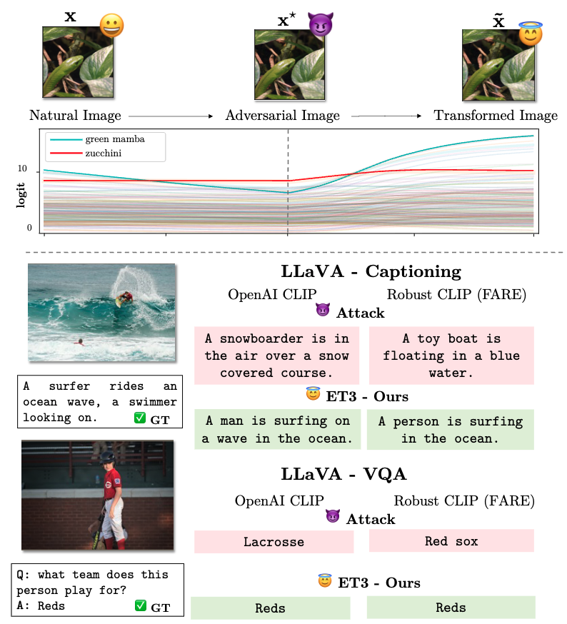

# ET3: Energy-Guided Test-Time Transformation

<div align="center">

### A Provable Energy-Guided Test-Time Defense Boosting Adversarial Robustness of Large Vision-Language Models

**Mujtaba Hussain Mirza¹ · Antonio D'Orazio¹ · Odelia Melamed² · Iacopo Masi¹**

¹ OmnAI Lab, Computer Science Department, Sapienza University of Rome, Italy  
² Weizmann Institute of Science, Israel

<br>

[](https://arxiv.org/abs/2603.26984)
[](https://openaccess.thecvf.com/content/CVPR2026/html/Mirza_A_Provable_Energy-Guided_Test-Time_Defense_Boosting_Adversarial_Robustness_of_Large_CVPR_2026_paper.html)
[](https://cvpr.thecvf.com/virtual/2026/poster/37688)

**[ArXiv](https://arxiv.org/abs/2603.26984) • [CVPR Paper](https://openaccess.thecvf.com/content/CVPR2026/html/Mirza_A_Provable_Energy-Guided_Test-Time_Defense_Boosting_Adversarial_Robustness_of_Large_CVPR_2026_paper.html) • [Poster & Video](https://cvpr.thecvf.com/virtual/2026/poster/37688)**

</div>

---

<p align="center">
  
</p>

> **ET3** is a lightweight, training-free test-time defense that improves adversarial robustness by minimizing an energy function derived from model logits. The method can be applied directly at inference time and improves robustness for robust classifiers, zero-shot classification with CLIP, and Large Vision-Language Models (LVLMs) such as LLaVA.

## ✨ Key Features

- 🔒 Training-free test-time defense
- ⚡ Lightweight and efficient
- 🎯 Works with robust classifiers and CLIP for zero-shot classification
- 🖼️ Improves robustness of image captioning and VQA models
- 📈 Effective under both standard and adaptive attacks

## 📚 Citation

If you find this work useful, please cite:

```bibtex
@InProceedings{Mirza_2026_CVPR,
    author    = {Mirza, Mujtaba Hussain and D'Orazio, Antonio and Melamed, Odelia and Masi, Iacopo},
    title     = {A Provable Energy-Guided Test-Time Defense Boosting Adversarial Robustness of Large Vision-Language Models},
    booktitle = {Proceedings of the IEEE/CVF Conference on Computer Vision and Pattern Recognition (CVPR)},
    month     = {June},
    year      = {2026},
    pages     = {8598-8609}
}
```

## 🙏 Acknowledgements

This repository builds upon the codebase from:

- https://github.com/chs20/RobustVLM
